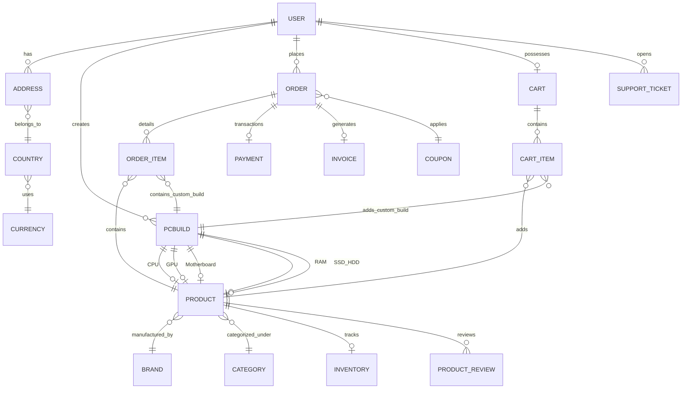

# Custom PC Builder Platform 🖥️📦
> A modern, premium, and localized E-Commerce Platform & Interactive PC Build Configurator. Built on a dual-architecture framework of Django (MVC) and Django REST Framework (API).

---

## 🛠️ Technology Stack & Languages

The platform is designed with a premium frontend layout using Glassmorphic panels, custom CSS variables, and modern grids, backed by a robust and relational Python-based server.

| Layer | Technology | Details / Usage |
| :--- | :--- | :--- |
| **Backend Framework** | **Python (Django 5.x)** | Core server architecture, MVC routers, Django Admin customization, forms, and business logic. |
| **REST API Engine** | **Django REST Framework (DRF)** | Comprehensive viewsets and endpoints (`/api/*`) for decoupled integrations. |
| **Database** | **SQLite3 / PostgreSQL** | Relational data storing. Out-of-the-box support for PostgreSQL production scaling. |
| **Frontend Layout** | **HTML5 & Vanilla CSS3** | Custom typography, variables, responsive design, sleek glassmorphism panels, and loaders. |
| **Frontend Frameworks** | **Bootstrap 5 & FontAwesome 6** | Grid system, UI utilities, clean layout resets, and custom icons. |
| **Interactive Logic** | **Vanilla JS (ES6+ / AJAX)** | Real-time page mutations, dynamic forms, Swiper JS presets carousel, and SweetAlert2 interactive alerts. |
| **Payment Gateways** | **Stripe / Razorpay / PayPal** | Full-fledged SDK hooks for key authorization and checkout payment state confirmation. |
| **Doc Generator** | **ReportLab (Python PDF)** | Low-level drawing canvas and document styling for dynamic PDF invoice rendering. |
| **DevOps** | **Docker** | Containerization of the Django, static server, and DB environment. |

---

## 💎 Key Features

### 1. Component Database & Technical Constraints
Stores PC hardware components categorized under standard groupings. Each product maintains strict electrical, physical, and interface constraints:
* **TDP (Thermal Design Power)** values to calculate power requirements.
* **Socket and Slots** specification for CPUs, RAMs, Motherboards, and Coolers.
* **Form Factor** dimensions for Motherboard, Cabinet, and PSUs.
* **GPU & CPU Cooler clearances** (in mm) for cabinet dimensions.
* **PCIe Lanes and Generations** for NVMe and GPU bandwidth evaluation.

### 2. Live Compatibility Engine (`builder/compatibility.py`)
Analyzes active PC builds on-the-fly and generates **Errors**, **Warnings**, or **Suggestions** across 11 checks:
1. **CPU & Motherboard Socket Matching**: E.g., alerts if attempting to place an Intel LGA1700 CPU on an AMD AM5 Motherboard.
2. **RAM & Motherboard DDR Type Matching**: Verifies DDR4 vs DDR5 standard matching.
3. **Motherboard & Cabinet Form Factor Support**: Ensures larger E-ATX/ATX boards aren't paired with Mini-ITX cases.
4. **Cabinet & CPU Cooler Height Clearance**: Prevents selecting tall cooler towers that exceed cabinet widths.
5. **Cabinet & GPU Length Clearance**: Ensures massive triple-fan graphics cards fit inside selected PC cases.
6. **Power Supply Sufficiency**: Computes the exact power consumption of all connected parts and compares it to PSU wattage with an added **20% safety margin**.
7. **CPU Cooler Socket Compatibility**: Warns if the cooler bracket does not match the CPU socket out-of-the-box.
8. **Motherboard NVMe Slots Availability**: Flags if a selected M.2 drive cannot be hosted on a board lacking NVMe slots.
9. **PCIe Version Bottleneck**: Flags mismatches (e.g., PCIe Gen5 card on Gen4 slot) warning that the interface will scale down.
10. **RAM Speed Downclocking**: Warns if RAM speed exceeds the motherboard's maximum supported clock speed.
11. **SSD Speed Mismatch**: Warns if the SSD generation exceeds motherboard M.2 slot speeds.

### 3. Localized Currency & Multi-Country Taxes
Unlike basic systems, this platform features dynamic currency conversion and regional taxing:
* **Exchange Rates**: Currencies can be switched on-the-fly, dynamically adjusting costs using customizable base conversion factors.
* **Regional Taxes & Shipping**: Selecting a Country sets default VAT/GST rates (e.g. 18% GST for India) and baseline shipping overheads automatically.

### 4. Smart Order Cancellation & Restocking Fee Policies
* Standard component purchases can be cancelled instantly before they are shipped.
* Custom PC configuration builds involve custom labor and unpacking. Therefore, if a user cancels a custom PC assembly **after 24 hours**, or when the build is already **packed/ready**, a **15% Restocking Fee** is automatically deducted.

### 5. Automated PDF Invoicing (`orders/utils.py`)
Generates premium invoices using **ReportLab Platypus**:
* Generates a header with a royal blue brand banner.
* Draws a dynamic **QR Code** containing verification URL and order numbers.
* Lists granular calculations of subtotals, tax rate applications, shipping costs, and currency symbols.

### 6. Target System Classification & Auto-Build Population
Allows users to classify their rig for specific workloads (e.g. *Crypto Currency System*, *Day Trading System*, *AI Workstation*) and enter custom hardware goals (e.g. "32GB RAM, 850W PSU").
* **Auto-Population Engine**: When a user enters any target system, the configurator automatically searches the database and chooses compatible components (matched by socket, RAM type, form factors, and power capacities) to populate all empty required slots.
* **Workload-Specific Diagnostics**: Audits chosen parts against target tasks:
  * *Crypto/Mining*: Demands dedicated GPU presence and warns if PSU capacity is below 750W.
  * *Day Trading*: Recommends >=16GB memory and a display monitor setup.
  * *AI/Deep Learning*: Warns if no CUDA-compatible (NVIDIA RTX) GPU is selected.
* **Smart Parsing**: Automatically reads capacity strings (like `32GB RAM` or `850W PSU`) from custom requirements, compares them to actual selected parts, and warns if requirements are unmet.
* **Workspace Slot Flagging**: Displays an indicator badge next to each slot (e.g. `Required Component` vs `Optional Component`) based on the target system classification.
* **Setup Progress Bar**: Tracks and visualizes completion progress (e.g., `3/6 Parts (50%)`) and explicitly details missing required parts.

---

## 📊 Database Schema



---

## 🎯 Step-by-Step Presentation Flow

Make sure you run the local server before initiating the presentation. You can start it via:
`.\venv\Scripts\python.exe manage.py runserver`

### Step 1: Landing Page & Localizations
1. Navigate to `http://127.0.0.1:8000/` in your web browser.
2. Scroll through the homepage to show the responsive layout and featured products.
3. In the navigation bar header, locate the **Country** and **Currency** selectors.
4. Change the selection (e.g. from USD to INR or EUR) to show how every product card updates its price, symbol, and taxes.

### Step 2: Custom Profile & Referrals
1. Click **Register** in the top navigation.
2. Sign up a new customer account.
3. Highlight the **Referral Program** in the signup form. Note that a referral code is generated for every user profile upon creation.
4. Go to **My Profile** -> **Addresses**. Add a shipping address. Point out that the country determines default shipping & tax fees at checkout.

### Step 3: PC Build Configurator Workspace & Target System Audits
1. Navigate to the **Configurator Workspace** (/builder/).
2. Scroll to the bottom of the left column to view the **Target System Use-Case** card.
3. Type in a classification such as "Crypto Currency System" or "Trading System", and type a custom requirement like "32GB RAM, 850W PSU". Click **Update System Requirements**.
4. Look at the **Capability Requirements Audit** block on the right. Notice it warns you about missing parts (e.g., "Crypto mining systems require a high-performance GPU" or "Day trading terminals benefit from at least 16GB RAM").
5. Add components in the matrix:
   * Select a CPU (e.g., AMD Ryzen 5 7600).
   * Try to add an incompatible Motherboard (e.g. Intel socket board).
   * Point out the **Live Compatibility Box** at the top right: it will turn red and display the *Incompatible Socket Error*.
   * Show the **Suggestions box**: Replace the board with a compatible one.
   * Add a RAM module (e.g. 16GB) and PSU (e.g. 650W).
6. Look back at the **Capability Requirements Audit**: Note the error indicating that your selected 16GB RAM and 650W PSU do not meet the custom "32GB RAM, 850W PSU" constraints you specified.
7. Upgrade your RAM to 32GB and PSU to 850W. Watch the audit status dynamically turn into green checkmarks!
8. Click **Save Configuration** at the top. Note that you can review or modify these target system details on the save page before final persistence.

### Step 4: Cart Checkout & Coupon Mechanics
1. From the Configurator, click **Add Build to Cart**.
2. Add standalone accessories (like a gaming mouse or keyboard) from the products store to the cart.
3. Navigate to the **Shopping Cart** page.
4. Apply a coupon code (e.g. `WELCOME10` if generated in Django admin) and highlight the discount subtraction.
5. Click **Checkout**.

### Step 5: Secure Payments & Invoices
1. Select a payment method (Simulated Stripe, Razorpay, or Cash on Delivery).
2. Complete the checkout form. 
3. After redirecting to the **Order Success Page**, click **Download Invoice PDF**.
4. Open the PDF to showcase the layout: the royal blue accent bar, table breakdown, and QR code verified security.

### Step 6: Admin Dashboard & Inventory Audit
1. Navigate to `/admin/` and log in with your superuser credentials.
2. Show the custom dark-themed administration page.
3. Locate **Inventory** and show how the inventory levels drop and transition to **Reserved Stock** during order pending states to prevent overselling.

---

## 🚀 Setup & Execution Guide

Ensure you have Python installed, then execute these commands in your console:

1. **Activate Virtual Environment**:
   ```powershell
   .\venv\Scripts\activate
   ```
2. **Install Requirements**:
   ```bash
   pip install -r requirements.txt
   ```
3. **Execute Migrations**:
   ```bash
   python manage.py migrate
   ```
4. **Create Administrative User**:
   ```bash
   python manage.py createsuperuser
   ```
5. **Launch Server**:
   ```bash
   python manage.py runserver
   ```
   *The website will be online at [http://127.0.0.1:8000/](http://127.0.0.1:8000/).*
